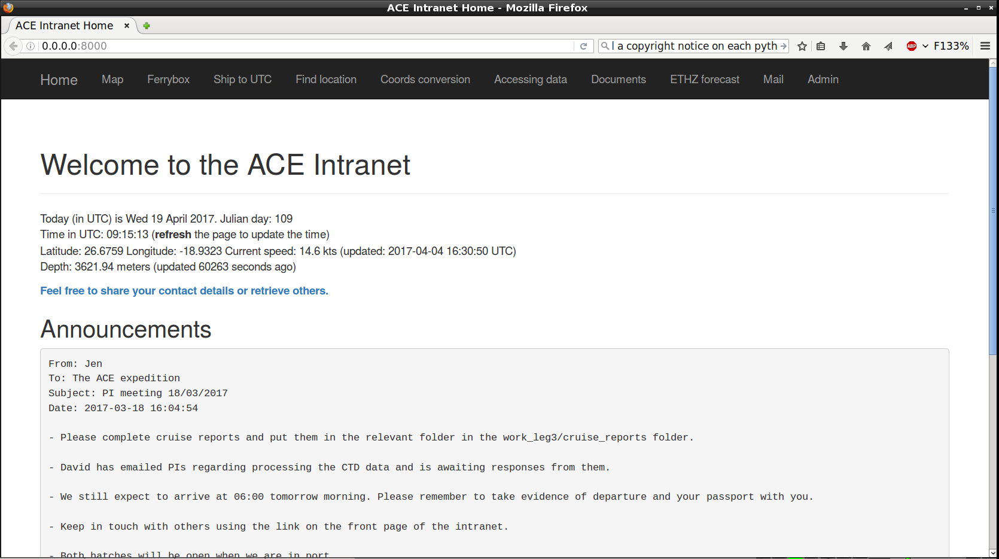

# Introduction

No good documentation has been written for this project: it was developed during a science expedition with lack of time. It needs a long time to write documentation and cover evertyhing which is:

* system to enter events by our users with associated information
* script to backup hard disks (or SD cards, etc.) to the NAS storage (drive by a database table)
* script to backup from Windows shared folders into the NAS storage (driven by a database table)
* web utilities for changing coordinates, location from ship time, etc.
* CTD cast information
* map with the track
* real time data from the Ferrybox
* importer from our specific (Chelsea) Ferrybox
* daily messages
* importer for samples
* importer for events
* importer from GPS NMEA files (one per day) into the database
* utilities to generate event sheets or samples+event sheets from specific spreadsheets
* the basis of the email system: it generates and drives fetchmail to download specific accounts in order of emails received by the remote server
* quality checker for Ferrybox data
* quality checker for GPS data (e.g. compare two GPS, generate tracks per GPS to be displayed by qgis or some GIS software)
* imports multi beam raw files from MBSystem JSON output

# Screenshots
No good documentation has been written but a few screenshots have been taken to have a feel of how the application looks like:

Carles Pina (carles@pina.cat) and Jen Thomas (jenny_t152@yahoo.co.uk), 2016-2017.
